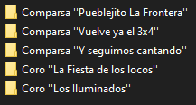
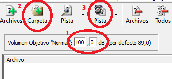

# TODO EL CARNAVAL

## PROCESO

### PISTA EN BRUTO

1. Lo primero que haremos es buscar en <a href="https://www.exvagos.org/forums/carnaval.289/">Carnaval | ExVagos</a> lo que queremos subir. En caso de no encontrarla ahí, necesitamos descargar la actuación completa con <a href="https://es3.ytmp3.mobi/">Youtube to mp3</a> y luego cortarla con <a href="https://github.com/audacity/audacity/releases/download/Audacity-3.4.2/audacity-win-3.4.2-64bit.exe">Audacity</a>. El resultado será similar a este:

    
    
    El formato sería: Agrupación ''Nombre''. En el explorador de Windows las comillas deben ser simples, no dobles, por tanto pondremos ( ' ) dos veces. 
        
        ⚠SPOILER⚠ => En la etiqueta del álbum si pondremos comillas dobles ( " ).

2. Abrimos <a href="https://sourceforge.net/projects/mp3gain/files/MP3Gain-Windows%20%28Stable%29/1.2.5/mp3gain-win-1_2_5.exe/download">MP3Gain</a>, nos aseguramos que el *Volumen "Objetivo" sea **100dB***, volcamos la carpeta de los archivos y le damos al botón indicado en el paso 3:

    

3. El siguiente paso es descargar <a href="https://www.mp3tag.de/en/dodownload.html">mp3tag</a> e instalar su [configuración](Mp3tagSettings.zip).

* <a href="https://music.youtube.com/watch?v=WO0AiAkMqGU&amp;list=PLxLDSnc1P_4ayG99EZcW-zgDovmeJUpw6">YouTube Music</a>